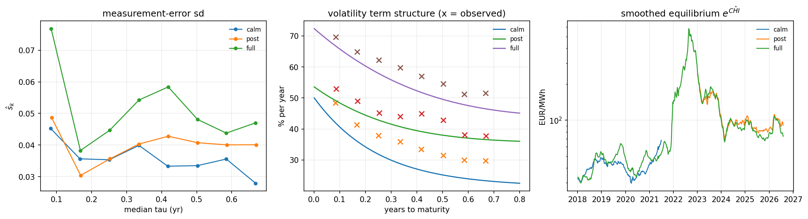
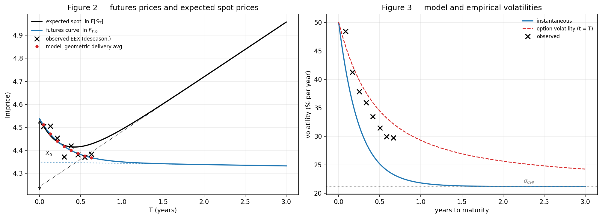
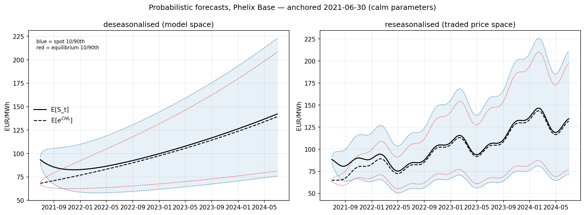
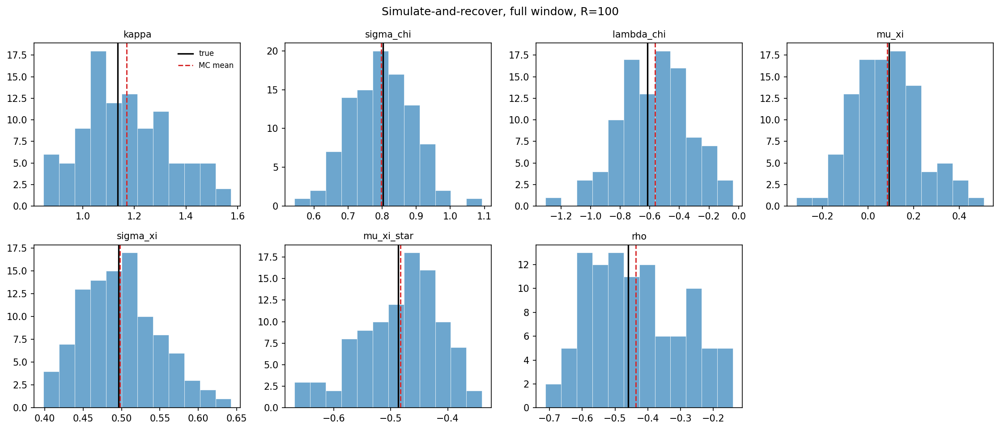

# Schwartz–Smith Two-Factor Model on EEX Phelix Base Power Futures

An end-to-end implementation of the Schwartz & Smith (2000) short-term/long-term
commodity model, estimated by Kalman filtering and maximum likelihood on German
power futures (EEX Phelix Base, monthly delivery) from Bloomberg, 2018–2026.

The study is scoped to **short-term dynamics**: the panel's longest observable
maturity is $\tau = 0.71$ years. Extension to quarterly and calendar-year
contracts is discussed under [Limitations](#limitations).

---

## Contents

- [What this is](#what-this-is)
- [Notation](#notation)
- [The model](#the-model)
- [Data](#data)
- [Cleaning pipeline](#cleaning-pipeline)
- [Three methodological decisions](#three-methodological-decisions)
- [State-space form and estimation](#state-space-form-and-estimation)
- [Results](#results)
- [Valuation output](#valuation-output)
- [Diagnostics](#diagnostics)
- [Monte Carlo validation](#monte-carlo-validation)
- [Limitations](#limitations)
- [Repository layout](#repository-layout)
- [Reproducing](#reproducing)
- [References](#references)

---

## What this is

Schwartz & Smith decompose the log spot price of a commodity into two latent
factors — a mean-reverting short-term deviation and a random-walk equilibrium
level. Neither is observable; both are recovered from the futures curve by
Kalman filtering, with the model parameters estimated by maximising the
prediction-error decomposition of the likelihood.

The original paper applies this to crude oil. Power is a harder case: it is
non-storable, its futures are *delivery-period* (flow) contracts rather than
point-maturity claims, and it carries a large deterministic seasonal component
that oil does not. This repository works through those three complications
explicitly rather than approximating them away, and reports the diagnostics that
show where the two-factor structure still falls short.

Everything here is reproducible from a single raw Bloomberg export.

---

## Notation

The paper's symbols are used throughout, and they coincide with the code's field
names:

| symbol | meaning | code |
|---|---|---|
| $\chi_t$ | short-term deviation | `chi` |
| $\xi_t$ | equilibrium price level | `xi` |
| $\kappa$ | mean-reversion rate of $\chi$ | `kappa` |
| $\sigma_\chi,\ \sigma_\xi$ | factor volatilities | `sigma_chi`, `sigma_xi` |
| $\rho_{\chi\xi}$ | correlation of increments | `rho` |
| $\mu_\xi,\ \mu_\xi^{*}$ | equilibrium drift under $\mathbb{P}$ and $\mathbb{Q}$ | `mu_xi`, `mu_xi_star` |
| $\lambda_\chi,\ \lambda_\xi$ | risk premia | `lambda_chi`, `lambda_xi` |
| $s_k$ | measurement-error sd of maturity slot $k$ | `s[k]` |
| $\tau = T - t$ | time to delivery | `tau` |

---

## The model

The log spot price decomposes into two latent factors,

```math
\ln S_t = \chi_t + \xi_t
```

where the short-term deviation reverts to zero as an Ornstein–Uhlenbeck process
and the equilibrium level follows an arithmetic Brownian motion:

```math
d\chi_t = -\kappa \chi_t \, dt + \sigma_\chi \, dz_\chi
```

```math
d\xi_t = \mu_\xi \, dt + \sigma_\xi \, dz_\xi \, , \qquad dz_\chi \, dz_\xi = \rho_{\chi\xi} \, dt
```

Given $(\chi_0, \xi_0)$, the pair $(\chi_t, \xi_t)$ is jointly normal with

```math
\mathbb{E}\left[ (\chi_t, \xi_t) \right] = \left[ \, e^{-\kappa t}\chi_0, \;\; \xi_0 + \mu_\xi t \, \right]
```

```math
\mathrm{Cov}\left[ (\chi_t, \xi_t) \right] =
\begin{bmatrix}
\left(1 - e^{-2\kappa t}\right) \dfrac{\sigma_\chi^{2}}{2\kappa} &
\left(1 - e^{-\kappa t}\right) \dfrac{\rho_{\chi\xi}\sigma_\chi\sigma_\xi}{\kappa} \\
\left(1 - e^{-\kappa t}\right) \dfrac{\rho_{\chi\xi}\sigma_\chi\sigma_\xi}{\kappa} &
\sigma_\xi^{2} t
\end{bmatrix}
```

so that

```math
\mathbb{E}\left[ \ln S_t \right] = e^{-\kappa t}\chi_0 + \xi_0 + \mu_\xi t
```

```math
\mathrm{Var}\left[ \ln S_t \right] = \left(1 - e^{-2\kappa t}\right)\frac{\sigma_\chi^{2}}{2\kappa} + \sigma_\xi^{2} t + 2\left(1 - e^{-\kappa t}\right)\frac{\rho_{\chi\xi}\sigma_\chi\sigma_\xi}{\kappa}
```

and, the spot price being lognormal,

```math
\ln \mathbb{E}\left[ S_t \right] = \mathbb{E}\left[ \ln S_t \right] + \tfrac{1}{2}\mathrm{Var}\left[ \ln S_t \right]
```

### Risk-neutral dynamics

Two constant risk premia reduce the drifts:

```math
d\chi_t = \left( -\kappa\chi_t - \lambda_\chi \right) dt + \sigma_\chi \, dz_\chi^{*} \, , \qquad d\xi_t = \left( \mu_\xi - \lambda_\xi \right) dt + \sigma_\xi \, dz_\xi^{*}
```

Under $\mathbb{Q}$ the short-term deviation reverts to $-\lambda_\chi / \kappa$
rather than zero, and the equilibrium drift becomes
$\mu_\xi^{*} = \mu_\xi - \lambda_\xi$. The covariance matrix is unchanged, so

```math
\mathbb{E}^{*}\left[ \ln S_t \right] = e^{-\kappa t}\chi_0 + \xi_0 - \left(1 - e^{-\kappa t}\right)\frac{\lambda_\chi}{\kappa} + \mu_\xi^{*} t \, , \qquad \mathrm{Var}^{*}\left[ \ln S_t \right] = \mathrm{Var}\left[ \ln S_t \right]
```

The implied risk premium in log price is

```math
\mathbb{E}\left[ \ln S_t \right] - \mathbb{E}^{*}\left[ \ln S_t \right] = \left(1 - e^{-\kappa t}\right)\frac{\lambda_\chi}{\kappa} + \lambda_\xi t
```

### Futures valuation

Futures prices are risk-neutral expected spot prices, so

```math
\ln F_{T,0} = \mathbb{E}^{*}\left[ \ln S_T \right] + \tfrac{1}{2}\mathrm{Var}^{*}\left[ \ln S_T \right] = e^{-\kappa T}\chi_0 + \xi_0 + A(T)
```

with all maturity-dependent terms collected into

```math
A(T) = \mu_\xi^{*} T - \left(1 - e^{-\kappa T}\right)\frac{\lambda_\chi}{\kappa} + \tfrac{1}{2}\left[ \left(1 - e^{-2\kappa T}\right)\frac{\sigma_\chi^{2}}{2\kappa} + \sigma_\xi^{2} T + 2\left(1 - e^{-\kappa T}\right)\frac{\rho_{\chi\xi}\sigma_\chi\sigma_\xi}{\kappa} \right]
```

The instantaneous volatility of $\ln F_{T,0}$ is independent of the state:

```math
\sigma_F^{2}(T) = e^{-2\kappa T}\sigma_\chi^{2} + \sigma_\xi^{2} + 2 e^{-\kappa T}\rho_{\chi\xi}\sigma_\chi\sigma_\xi
```

which collapses from $\sqrt{\sigma_\chi^{2} + \sigma_\xi^{2} + 2\rho_{\chi\xi}\sigma_\chi\sigma_\xi}$
at $T = 0$ to $\sigma_\xi$ as $T \to \infty$. For European options on futures the
relevant quantity is

```math
\sigma_\phi^{2}(t,T) = e^{-2\kappa (T-t)}\left(1 - e^{-2\kappa t}\right)\frac{\sigma_\chi^{2}}{2\kappa} + \sigma_\xi^{2} t + 2 e^{-\kappa (T-t)}\left(1 - e^{-\kappa t}\right)\frac{\rho_{\chi\xi}\sigma_\chi\sigma_\xi}{\kappa}
```

which is implemented in `cell_futures.py`.

---

## Data

Bloomberg `BDH` export of EEX Phelix Base **month** futures, ticker root `DET`.

| | |
|---|---|
| Contracts | 120 (`DETF18` … `DETZ27`) |
| Fields | `PX_SETTLE`, `PX_VOLUME`, `OPEN_INT` |
| Raw shape | 2,253 × 367 |
| Trading days | 2,242, 2018-01-01 → 2026-08-04 |
| Units | EUR/MWh |
| `#N/A N/A` cells | 401,054 (≈50% of the data region) |

The export also carries a contract reference table (delivery start, delivery
end, `LAST_TRADEABLE_DT`, delivery hours) used for expiry masking and delivery
geometry.

---

## Cleaning pipeline

The export is not usable as delivered. `clean_phelix.py` performs the following
in order, with hard assertions rather than silent coercion.

**Structural parse.** Two unrelated blocks share the sheet — a contract
reference table and the price panel. Column triples are located from the ticker
banner and the field header is asserted to be
`PX_SETTLE / PX_VOLUME / OPEN_INT`, not assumed.

**Date parsing.** Excel wrote day $\leq 12$ as `D/M/YYYY` and the rest as
`DD-MM-YYYY`. Both are day-first; verified against the trading calendar.

**Validation gates.** Ticker month codes agree with delivery months; delivery
end is the true month end; the last tradeable date precedes the delivery end;
dates are strictly increasing with no weekends; all prices are strictly
positive; and the delivery-hour count recomputed from a `zoneinfo`
Europe/Berlin calendar matches Bloomberg's column for all 120 contracts —
including 743 hours every March and 745 every October, which is the
daylight-saving transition.

**Post-expiry mask.** Bloomberg carries the final settlement forward
indefinitely; `DETF18` sits at 29.46 for 2,200 days after it died. For all 120
contracts the last date on which the price changes equals `LAST_TRADEABLE_DT`
exactly, so the mask is exact rather than heuristic.

**In-delivery mask.** EEX months trade *through* their delivery month, where the
price is part realised spot average and part forward. The futures equation does
not describe that, so observations with $t \geq T_1$ are dropped.

**Phantom run mask.** `DETZ27` reads a flat 30.30 with non-zero open interest
for its first 2,066 rows. Caught by a generic rule (leading constant run longer
than 5 trading days); no other contract has a leading run longer than 2 days.

**Holiday rows.** 57 dates on which no live contract moved — Jan 1, Good Friday,
Easter Monday, May 1, Dec 24/25/26, Dec 31.

**Outliers: none removed.** The only surviving extreme cluster is
2022-02-24/25, log-returns of 0.35–0.40 across the whole strip. That is the
invasion of Ukraine, and it is real.

```
raw price cells                141,001
  post-expiry / in-delivery    -116,711
  DETZ27 phantom lead run        -2,066
holiday dates dropped                57
surviving observations           21,611
```

Zero interior gaps: once a contract begins quoting it quotes every trading day
until expiry, so no interpolation occurs anywhere in the pipeline.

**Output.** Three date windows, each a self-contained folder:

| window | span | weekly obs | character |
|---|---|---|---|
| `calm` | 2018-01 → 2021-06 | 183 | pre-crisis, max settle 89.8 |
| `post` | 2023-01 → 2026-08 | 188 | post-crisis, max settle 200.7 |
| `full` | 2018-01 → 2026-08 | 449 | includes the crisis, max settle 871.8 |

`full` is *not* `calm` $\cup$ `post`: the 78 weeks from 2021-07 to 2022-12
belong to `full` alone, and they carry prices an order of magnitude above
anything in either sub-window.

---

## Three methodological decisions

These are the places where a naive port of the oil implementation would be wrong
for power.

### 1. Constant-maturity slots

Every EEX month future has a finite life, so the set of live tickers changes
monthly, while the Kalman filter needs a fixed-width observation vector. Each
trade date's surviving contracts are ranked by time to delivery and slot $k$ is
defined as the $k$-th nearest month. Roughly ten monthlies quote at any time
(EEX cascades quarters into months about nine months ahead), and $n = 8$ gives a
completely dense panel — zero missing values across all 2,185 trading days;
$n = 9$ fails on seven dates.

| slot $k$ | 1 | 2 | 3 | 4 | 5 | 6 | 7 | 8 |
|---|---|---|---|---|---|---|---|---|
| median $\tau$ (yr) | 0.08 | 0.17 | 0.25 | 0.33 | 0.42 | 0.50 | 0.58 | 0.67 |

A slot is a *position*, not a contract: 42 distinct tickers pass through slot 1
over the `calm` window. $\tau$ within a slot sawtooths, which is harmless
because $Z_t$ and $d_t$ are evaluated at each observation's actual maturity.

### 2. Geometric delivery averaging

A Phelix month future settles against the *average* hourly spot over its
delivery period $[T_1, T_2]$, so strictly

```math
F_t^{\text{flow}} = \sum_{u \in [T_1, T_2]} w_u \, F(t, u) \, , \qquad \sum_u w_u = 1
```

Taking logs of a sum of exponentials of the state is **not affine in**
$(\chi_t, \xi_t)$, which would break the exactness of the linear Kalman filter.
The geometric average *is* affine and therefore drops straight into the existing
recursion:

```math
\ln F_t^{\text{geo}} = \left[ \sum_u w_u e^{-\kappa u} \right] \chi_t + \xi_t + \sum_u w_u A(u)
```

with $w_u$ the DST-correct hour weights. Simulation at plausible power
parameters puts the geometric approximation error at $3 \times 10^{-6}$ to
$1.6 \times 10^{-5}$ log points, against $5 \times 10^{-5}$ to
$1 \times 10^{-4}$ for the common delivery-midpoint shortcut. Under crisis-like
parameters ($\kappa = 6$, $\sigma_\chi = 1.2$) the midpoint error on the front
contract reaches $1 \times 10^{-2}$ — comparable to the estimated measurement
noise itself, and systematic in sign. Geometric averaging costs nothing and
removes that bias; the fitted mean errors per slot come out at $10^{-4}$ to
$3 \times 10^{-3}$ with no maturity-dependent pattern.

### 3. Seasonality indexed on delivery time

Power carries a large deterministic annual shape that the two-factor structure
cannot produce: $e^{-\kappa\tau}$ is monotone in maturity, so a seasonal
sawtooth across the strip would be forced entirely into the measurement error,
violating both the diagonal-$V$ and the iid assumptions.

The spot price is therefore written as

```math
\ln S_u = g(u) + \chi_u + \xi_u \qquad \Longrightarrow \qquad \ln F(t,T) = \bar{g}(T) + e^{-\kappa\tau}\chi_t + \xi_t + A(\tau)
```

with a mean-zero three-harmonic seasonal, hour-averaged over each contract's
delivery period:

```math
\bar{g}(T_i) = \sum_{j=1}^{3} \left[ a_j \bar{c}_{ji} + b_j \bar{s}_{ji} \right] \, , \qquad
\bar{c}_{ji} = \sum_u w_{iu} \cos\left( 2\pi j \varphi_u \right) \, , \qquad
\bar{s}_{ji} = \sum_u w_{iu} \sin\left( 2\pi j \varphi_u \right)
```

where $\varphi_u$ is the position of delivery day $u$ within the year. The
coefficients are estimated by a two-way fixed-effects regression with date
effects absorbed by within-date demeaning (Frisch–Waugh), so it reduces to a
six-column OLS rather than a 2,185-dummy problem.

Three points differ from a standard spot-price seasonal specification:

- **Indexed on delivery time, not trade time.** $\bar{g}$ varies across the
  cross-section at fixed $t$; a function of trade date would be constant across
  all eight slots and remove nothing.
- **No intercept and no linear trend.** A constant is perfectly collinear with
  $\xi_t$, and a linear trend $\beta_1 T = \beta_1 (t + \tau)$ splits into
  pieces competing with $\mu_\xi$ and $\mu_\xi^{*}$. $\xi$ carries all level and
  trend.
- **Annual frequencies only.** A month contract integrates over roughly 30 days
  $\times$ 24 hours, so weekly and intraday cycles are annihilated by the
  delivery averaging and are not identifiable from this panel. With 12 distinct
  delivery months per year, Nyquist caps the expansion at six harmonics.

| window | partial $R^2$ | peak-to-trough (log pts) |
|---|---|---|
| `calm` | 0.625 | 0.239 |
| `post` | 0.704 | 0.374 |
| `full` | 0.621 | 0.331 |

Three harmonics explain 62–70% of the within-date cross-sectional variance in
log futures prices. The amplitude grows 56% between the pre- and post-crisis
regimes — a 37% winter/spring spread after 2023 against 24% before — which is
why $\bar{g}$ is fitted separately per window.

---

## State-space form and estimation

With $x_t = \left[ \chi_t, \, \xi_t \right]^{\top}$ and $y_t$ the vector of
deseasonalised log futures prices across the eight slots,

```math
x_t = c + G \, x_{t-1} + \omega_t \, , \qquad \omega_t \sim N(0, W)
```

```math
y_t = d_t + Z_t^{\top} \, x_t + v_t \, , \qquad v_t \sim N(0, V) \, , \qquad V = \mathrm{diag}\left( s_1^{2}, \dots, s_8^{2} \right)
```

```math
c = \begin{bmatrix} 0 \\ \mu_\xi \Delta t \end{bmatrix} \, , \qquad
G = \begin{bmatrix} e^{-\kappa \Delta t} & 0 \\ 0 & 1 \end{bmatrix} \, , \qquad
W = \mathrm{Cov}\left[ (\chi_{\Delta t}, \xi_{\Delta t}) \right]
```

with $d_t$ and $Z_t$ given by the geometric delivery form. The likelihood
follows from the prediction-error decomposition,

```math
-2 \ln L(\theta) \;=\; \sum_{t} \Big[\, n \ln 2\pi \;+\; \ln \det F_t \;+\; v_t^{\top} F_t^{-1} v_t \,\Big]
\qquad\text{where}\qquad
F_t = Z_t^{\top} R_t Z_t + V
```

### Flow

```
PRECOMPUTE (once)
  delivery-time grid, hour weights, deseasonalised y matrix
theta0  <-  method-of-moments seed  ->  unconstrained space
OUTER LOOP  [Nelder-Mead, then L-BFGS-B]
  for each candidate theta:
    untransform; build (c, G, W) per distinct step length
    evaluate Z, d on the full delivery grid (vectorised)
    set m0, C0  (stationary chi, diffuse xi)
    INNER LOOP over t:   predict -> forecast -> accumulate -> Joseph update
    return scalar l(theta)
POST-ESTIMATION (once)
  RTS smoother       ->  chi_{t|T}, xi_{t|T}
  numerical Hessian  ->  standard errors (delta method)
```

Implementation notes:

- **Method-of-moments seed from the volatility term structure.** The empirical
  variance of $\Delta \ln F$ per slot equals $\sigma_F^{2}(\tau)$, so fitting
  that one curve recovers $\kappa, \sigma_\chi, \sigma_\xi, \rho_{\chi\xi}$
  simultaneously. Roll transitions are masked so slot differences compare like
  with like.
- **$(c, G, W)$ per distinct step length.** Holiday-shifted weekly sampling
  gives irregular $\Delta t$ (5–10 days), so the transition blocks are built
  once per candidate $\theta$ for each distinct $\Delta t$ — still outside the
  recursion.
- **Joseph-form covariance update**, with Cholesky factorisation of $F_t$ for
  the log-determinant and quadratic form.
- **Measurement-error floor** $s_k = 10^{-4} + e^{\theta_k}$, preventing the
  optimiser from chasing $s_k \to 0$ as it does in the original paper's Table 2.
- **Delta-method standard errors**, since the Hessian is taken in the
  unconstrained parameterisation.

Optima were confirmed from multiple independent starts: `post` from 2, `full`
from 4, all reaching identical likelihood values.

---

## Results

Maximum-likelihood estimates, standard errors in parentheses.

| | `calm` | `post` | `full` |
|---|---|---|---|
| $\kappa$ | **3.4172** (0.3285) | **1.6455** (0.2984) | **1.1349** (0.1980) |
| $\sigma_\chi$ | 0.3568 (0.0337) | 0.4813 (0.0577) | 0.8027 (0.0909) |
| $\lambda_\chi$ | −0.3630 (0.1971) | +0.1472 (0.2637) | −0.6154 (0.2922) |
| $\mu_\xi$ | +0.2156 (0.1136) | −0.2749 (0.1961) | +0.0927 (0.1694) |
| $\sigma_\xi$ | 0.2120 (0.0166) | 0.3664 (0.0327) | 0.4962 (0.0516) |
| $\mu_\xi^{*}$ | −0.0280 (0.0211) | +0.0196 (0.0453) | −0.4871 (0.0940) |
| $\rho_{\chi\xi}$ | **+0.5223** (0.1143) | **−0.2227** (0.1640) | **−0.4594** (0.1529) |
| $s_1 \dots s_8$ | 0.028 – 0.045 | 0.030 – 0.049 | 0.038 – 0.077 |

| | `calm` | `post` | `full` |
|---|---|---|---|
| observations | 183 | 188 | 449 |
| $-\ln L$ | −2526.6 | −2372.8 | −4792.4 |
| half-life $\ln 2 / \kappa$ | 2.43 mo | 5.05 mo | 7.33 mo |
| $\lambda_\xi$ | +0.2436 | −0.2945 | +0.5798 |
| $\sigma_F(0)$ | 50.1% | 53.6% | 72.4% |
| mean abs. error (log) | 0.0435 | 0.0550 | 0.0645 |
| min Hessian eigenvalue | 2.32e+01 | 1.33e+01 | 9.12e+00 |



*Left: estimated measurement-error standard deviation $\hat{s}_k$ by maturity
slot. Centre: model volatility term structure $\sigma_F(\tau)$ against realised
per-slot volatilities (crosses), roll transitions excluded. Right: smoothed
equilibrium price $e^{\hat{\xi}_{t \mid T}}$ on a log scale — `calm` and `full` are
separately estimated yet nearly coincide over 2018–2021.*

All three Hessians are positive definite with no near-singular direction, so
every parameter — including $\lambda_\chi$ and $\mu_\xi$, the weakly identified
pair in the original paper — is estimable here. The time-series span of the
panel is what identifies the $\mathbb{P}$-measure drift; the Schwartz–Smith
indeterminacy argument bites on the cross-section.

**Findings.**

*$\rho_{\chi\xi}$ changes sign across the crisis.* $+0.52$ before, $-0.22$
after. Pre-crisis, a shock lifting the front of the curve lifted the whole
curve; post-crisis the two factors move against each other. This is the most
striking result in the table.

*Mean reversion slows.* Half-life $2.4 \to 5.0$ months between the two clean
regimes. The `full` value of 7.3 months should not be read structurally — a
single $\kappa$ fitted across a regime break is biased downward, because the
2021–22 level shift resembles one very slow-reverting deviation.

*$\lambda_\chi$ is negative pre-crisis.* Under $\mathbb{Q}$ the short-term
deviation reverts to $-\lambda_\chi / \kappa = +0.091$ rather than zero, so the
front of the futures curve sits above where the $\mathbb{P}$-measure would place
it. This is the opposite sign to the oil result in the original paper and is
consistent with hedging pressure from load-serving entities that are
structurally long forward demand.

*The long-run drift is not stable and should not be extrapolated.* $\mu_\xi$
comes out $+0.216$ on `calm` — almost exactly the realised drift of the smoothed
equilibrium over that sample, $+0.219$ — and $-0.275$ on `post`. The estimator
is reading a level shift as a permanent growth rate. Schwartz & Smith hit the
same problem in reverse on both oil datasets (their footnote 9) and fixed
$\mu_\xi$ exogenously. Here it is left free and the instability reported as a
result. Any forecast beyond about one year is dominated by this parameter and
should be treated as parametric extrapolation, not a projection.

---

## Valuation output



*Left: the fitted futures curve $\ln F_{T,0}$ against expected spot prices
$\ln \mathbb{E}[S_T]$, with observed EEX quotes (×) and the model's geometric
delivery-average fits (•), plus both long-run asymptote lines. Right: the model
volatility term structure $\sigma_F(T)$, collapsing from $\sigma_F(0)$ toward
$\sigma_\xi$ at the long end, with the annualised option volatility
$\sigma_\phi(T,T) / \sqrt{T}$.*



*Left: model space, deseasonalised. Right: the same forecast with $\bar{g}$
added back, in traded EUR/MWh. Both are anchored at the final observation of the
estimation window; the horizontal axis is a forecast horizon, not a data range.*

---

## Diagnostics

Standardised one-step-ahead innovations $e_t = F_t^{-1/2} v_t$, `full` window:

- **Mean errors $10^{-4}$ to $3 \times 10^{-3}$ across all eight slots** — no
  maturity-dependent bias, confirming the geometric delivery averaging.
- **Standardised innovation sd 0.92–1.10** — $F_t$ is correctly scaled.
- **Residual seasonal $R^2 = 0.001$** — the harmonic decomposition is complete.
- **Ljung–Box $Q(10)$ of 32–196 against a 95% critical value of 18.31**, with
  first-order autocorrelation up to 0.66 and cross-slot innovation correlation
  up to 0.39. The innovations are *not* independent.


The last point is the honest limitation of the model, and it is reported rather
than patched. Near-zero mean errors combined with heavily autocorrelated
residuals of comparable size at every maturity is the signature of a systematic
curve shape that two factors cannot span. The volatility term structure shows
the same thing from another angle: realised per-slot volatilities lie *above*
the model curve at every maturity in all three windows, with the gap widening
toward the long end.

Pricing error by year, `full` window (per-observation averages):

| year | log | % of price | EUR/MWh |
|---|---|---|---|
| 2018 | 0.041 | 4.2 | 1.99 |
| 2019 | 0.044 | 4.4 | 2.02 |
| 2020 | 0.057 | 5.6 | 2.01 |
| 2021 | 0.088 | 9.2 | 14.69 |
| **2022** | **0.121** | **12.2** | **42.72** |
| 2023 | 0.074 | 7.2 | 9.06 |
| 2024 | 0.057 | 5.7 | 4.63 |
| 2025 | 0.044 | 4.4 | 3.83 |
| overall | 0.065 | 6.5 | 9.76 |

The aggregate 6.5% conceals a threefold spread between the quiet years and 2022.
Note also that these are *one-week-ahead* errors conditional on a state vector
re-estimated every week: across the full window the cross-date standard
deviation of the log price level is 0.657 against a residual standard deviation
of 0.093, so $\xi$ absorbs the level and the residual measures curve shape only.
The model tracks the crisis; it does not predict it.

---

## Monte Carlo validation

Simulate-and-recover on the `full` window: 100 synthetic panels drawn from
$\hat{\theta}$ on the real maturity grid, priced through the geometric
measurement equation, perturbed by $s_k \varepsilon$, refitted, and compared
against the Hessian standard errors. Run in parallel, 404 s total (4.0 s per
replication).

| | true | MC mean | bias | MC sd | Hessian se | sd ratio |
|---|---|---|---|---|---|---|
| $\kappa$ | 1.1349 | 1.1702 | +0.0353 | 0.1663 | 0.1980 | 0.84 |
| $\sigma_\chi$ | 0.8027 | 0.7977 | −0.0050 | 0.0927 | 0.0909 | 1.02 |
| $\lambda_\chi$ | −0.6154 | −0.5653 | +0.0501 | 0.2370 | 0.2922 | 0.81 |
| $\mu_\xi$ | 0.0927 | 0.0837 | −0.0091 | 0.1533 | 0.1694 | 0.90 |
| $\sigma_\xi$ | 0.4962 | 0.4980 | +0.0018 | 0.0497 | 0.0516 | 0.96 |
| $\mu_\xi^{*}$ | −0.4871 | −0.4827 | +0.0044 | 0.0715 | 0.0940 | 0.76 |
| $\rho_{\chi\xi}$ | −0.4594 | −0.4361 | +0.0233 | 0.1385 | 0.1529 | 0.91 |



*$R = 100$ replications. Black line: the fitted value used to generate the
panels. Red dashed: the Monte Carlo mean.*

100/100 replications converged. Biases are small — the largest are $\kappa$ at
$+3.1\%$ and $\lambda_\chi$ at $+8.1\%$, both marginally significant at
$R = 100$ and consistent with the known finite-sample bias of mean-reversion
parameters. Every sd ratio falls in $0.76$–$1.02$, so the Hessian standard
errors are *not* optimistic; if anything they are mildly conservative.

**What this does and does not establish.** The synthetic panels are generated
from the model itself, so their innovations are iid by construction. This
confirms that the estimator and its Hessian are internally consistent — the code
recovers what it is given, and the reported standard errors are honest *under
the model's own assumptions*. It does not test whether those standard errors
survive the misspecification visible in the Ljung–Box statistics. Those are
distinct questions.

---

## Limitations

**Maximum maturity $\tau = 0.71$ years.** Only monthly contracts are used, and
EEX cascades quarters into months about nine months out. $\sigma_\xi$ and
$\mu_\xi^{*}$ are therefore identified over a short lever arm. The natural
extension is to add quarterly and calendar-year contracts — but their delivery
periods *nest*, since a calendar year is the hour-weighted average of its
quarters, which are the average of their months. Stacking all three tiers makes
$F_t$ near-singular and the diagonal-$V$ assumption indefensible; a
non-overlapping strip is required. Left as future work.

**Residual autocorrelation.** Documented above. Two factors do not span the
observed curve shape; a third factor, or stochastic short-term volatility, is
the natural next step.

**$\mu_\xi$ should not be extrapolated.** See Results. Fixing it exogenously (as
Schwartz & Smith do) is a reasonable robustness variant and is a one-line change.

**One seasonal per window.** The amplitude demonstrably shifted between regimes,
and `full` fits a single compromise shape across both. A time-varying seasonal
inside a constant-parameter model would be internally inconsistent, so this is
accepted rather than fixed.

**Data licensing.** The raw Bloomberg export is not redistributable and is not
included in this repository.

---

## Repository layout

```
clean_phelix.py        raw Bloomberg export -> cleaned, deseasonalised panels
ss_flow.py             load_window, geometric measurement equation, seasonal_g
ss_fit.py              estimation engine: MoM seed, Kalman, smoother, Hessian
mc_worker.py           worker module for the parallel Monte Carlo

notebook cells
  cell_kf_mle.py       single-window Kalman + MLE
  cell_diagnostics.py  innovation diagnostics and state plots
  cell_processes.py    P/Q state processes, spot moments, risk premium, Figure 1
  cell_futures.py      futures valuation, Figures 2 and 3
  cell_compare.py      fit all three windows, side-by-side comparison
  cell_mc.py           parallel simulate-and-recover

figures/               saved PNGs embedded in this README
prepped/
  contracts.csv        contract reference table
  qc_report.json       masks applied, seasonal coefficients, per-window summary
  calm/ post/ full/    y.npy, y_raw.npy, gbar.npy, tau_*.npy, U.npy, W.npy,
                       dt.npy, dates.npy, settle/volume/open_int, tickers.csv,
                       panel_long.csv
```

`U.npy` is $(n_T, n, 31)$ — the delivery-day times $u$ of every contract in
every slot, in years from the trade date. `W.npy` holds the matching DST-correct
hour weights $w_u$, padded with zeros for months shorter than 31 days.

---

## Reproducing

```bash
python clean_phelix.py GERMAN_POWER_EXCHANGE.csv prepped
```

Then run the notebook cells in order. Approximate timings on a modern laptop:

| step | time |
|---|---|
| cleaning, all three windows | < 1 min |
| `calm` fit (1 start) | ~2 min |
| `post` fit (2 starts) | ~4 min |
| `full` fit (4 starts) | ~21 min |
| Monte Carlo, $R = 100$, parallel | ~7 min |

Requires `numpy`, `pandas`, `scipy`, `matplotlib`. Python 3.9+ (`zoneinfo`).

The Monte Carlo worker must remain a `.py` module rather than a notebook cell —
on Windows and macOS the multiprocessing start method is `spawn`, so each child
process re-imports the module defining the worker, and a function defined in a
notebook cell is not importable.

---

## References

Schwartz, E. and J. E. Smith (2000). *Short-Term Variations and Long-Term
Dynamics in Commodity Prices.* Management Science 46(7), 893–911.

Gibson, R. and E. S. Schwartz (1990). *Stochastic Convenience Yield and the
Pricing of Oil Contingent Claims.* Journal of Finance 45, 959–976.

Harvey, A. C. (1989). *Forecasting, Structural Time Series Models and the Kalman
Filter.* Cambridge University Press.

---

## License

This project is for academic and educational purposes.

---

## Author

**Mudigonda Omkaar Sharma**  
B.Tech Electrical Engineering, Nirma University  
Research Interests: Power System Economics, Energy Markets, Stochastic Processes

[LinkedIn](https://www.linkedin.com/in/omkaar-sharma-b2b179200/) · [GitHub](https://github.com/Musashi1970)

*Independent research project in energy market stochastic modelling.*
